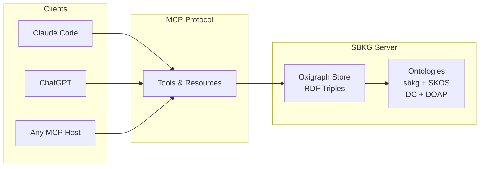

# sbkg-mcp

A **personal knowledge graph** exposed as an [MCP](https://modelcontextprotocol.io/) server. Store notes, bookmarks, concepts, and their relationships as **RDF triples** in a persistent [Oxigraph](https://github.com/oxigraph/oxigraph) database — then query them with **SPARQL** from any MCP-compatible LLM client.



## Why a Knowledge Graph?

Flat notes and bookmarks get lost. A knowledge graph lets you:

- **Connect** information across topics — a bookmark about React hooks automatically relates to your JavaScript notes, frontend project, and tutorial collection
- **Query** with precision — "show me all bookmarks tagged `python` that I haven't read yet" is a single SPARQL query
- **Build hierarchies** — SKOS lets you express that `react` is a narrower concept under `frontend`, so searching for `frontend` finds everything
- **Combine with other MCP servers** — pull emails, calendar events, or GitHub issues from other MCP connectors and link them into your graph

## Quick Start

### Installation

```bash
# Clone and install
git clone https://github.com/netsemantics/sbkg-mcp.git
cd sbkg-mcp
uv pip install -e .
```

### MCP Configuration

Add to your Claude Code MCP config (`~/.claude/settings.json` or project-level):

```json
{
  "mcpServers": {
    "sbkg": {
      "command": "uv",
      "args": ["run", "--directory", "/path/to/sbkg-mcp", "sbkg-mcp"]
    }
  }
}
```

### First Steps

Once connected, try these in your LLM client:

```
> "Add a bookmark for https://docs.pytest.org/ titled 'pytest docs' tagged with python and testing"

> "What bookmarks do I have?"

> "Show me everything tagged with 'python'"
```

## Examples

### Add a bookmark and query it

```
User: Save this link — https://hypothesis.readthedocs.io/
      Title it "Hypothesis Property-Based Testing" and tag it with python and testing.

LLM calls: sbkg_add_bookmark(
  title="Hypothesis Property-Based Testing",
  url="https://hypothesis.readthedocs.io/",
  tags=["python", "testing"],
  status="ToRead"
)
```

```
User: What testing resources do I have?

LLM calls: sbkg_query_sparql("""
  PREFIX sbkg: <http://sb.ai/kg/>
  SELECT ?title ?url WHERE {
    ?b a sbkg:Bookmark .
    ?b sbkg:hasTag ?tag .
    ?tag sbkg:title "testing" .
    ?b sbkg:title ?title .
    ?b sbkg:sourceUrl ?url .
  }
""")
```

### Batch import with SPARQL UPDATE

Instead of adding bookmarks one at a time, insert many in a single call:

```
User: Add these three bookmarks about Python testing.

LLM calls: sbkg_update_sparql("""
  PREFIX sbkg: <http://sb.ai/kg/>
  INSERT DATA {
    <http://sb.ai/kg/bookmark/pytest-docs> a sbkg:Bookmark ;
      sbkg:title "pytest documentation" ;
      sbkg:sourceUrl "https://docs.pytest.org/" ;
      sbkg:hasTag <http://sb.ai/kg/concept/python> ;
      sbkg:hasTag <http://sb.ai/kg/concept/testing> ;
      sbkg:hasStatus sbkg:Reference .
    <http://sb.ai/kg/bookmark/hypothesis> a sbkg:Bookmark ;
      sbkg:title "Hypothesis property-based testing" ;
      sbkg:sourceUrl "https://hypothesis.readthedocs.io/" ;
      sbkg:hasTag <http://sb.ai/kg/concept/python> ;
      sbkg:hasTag <http://sb.ai/kg/concept/testing> ;
      sbkg:hasStatus sbkg:ToRead .
    <http://sb.ai/kg/bookmark/coverage-py> a sbkg:Bookmark ;
      sbkg:title "Coverage.py" ;
      sbkg:sourceUrl "https://coverage.readthedocs.io/" ;
      sbkg:hasTag <http://sb.ai/kg/concept/python> ;
      sbkg:hasTag <http://sb.ai/kg/concept/testing> ;
      sbkg:hasStatus sbkg:ToRead .
  }
""")
```

### Build concept hierarchies with SKOS

```
User: Set up a tag hierarchy — "react" and "vue" should be
      subtopics of "frontend".

LLM calls: sbkg_update_sparql("""
  PREFIX sbkg: <http://sb.ai/kg/>
  PREFIX skos: <http://www.w3.org/2004/02/skos/core#>
  INSERT DATA {
    <http://sb.ai/kg/concept/react>
      skos:broader <http://sb.ai/kg/concept/frontend> .
    <http://sb.ai/kg/concept/vue>
      skos:broader <http://sb.ai/kg/concept/frontend> .
    <http://sb.ai/kg/concept/frontend>
      skos:narrower <http://sb.ai/kg/concept/react> ;
      skos:narrower <http://sb.ai/kg/concept/vue> .
  }
""")
```

Then query "everything under frontend" including subtopics:

```sparql
PREFIX sbkg: <http://sb.ai/kg/>
PREFIX skos: <http://www.w3.org/2004/02/skos/core#>
SELECT ?title ?url WHERE {
  ?tag skos:broader* <http://sb.ai/kg/concept/frontend> .
  ?b sbkg:hasTag ?tag .
  ?b sbkg:title ?title .
  ?b sbkg:sourceUrl ?url .
}
```

### Multi-MCP workflow: Email to knowledge graph

When SBKG is combined with an email MCP server (e.g. Gmail, Outlook), an LLM can extract knowledge from emails and store it:

```
User: Check my recent emails about the conference and save
      any useful info to my knowledge graph.

LLM calls: gmail_search(query="PyCon 2026", max_results=5)
  → Returns 3 emails with schedule and travel details

LLM calls: sbkg_add_note(
  title="PyCon 2026 - Travel & Schedule",
  content="Conference runs May 15-17. Talk accepted for Day 2. ..."
  tags=["conference", "python", "travel"],
  project="pycon-2026"
)

LLM calls: sbkg_add_bookmark(
  title="PyCon 2026 Schedule",
  url="https://us.pycon.org/2026/schedule/",
  tags=["conference", "python"]
)
```

See [docs/examples.md](docs/examples.md) for more workflows including GitHub integration, calendar events, and research pipelines.

## Tools

### Creating Data

| Tool | Purpose | Key Parameters |
|------|---------|----------------|
| `sbkg_add_note` | Create a note with metadata and triples | title, content, note_type, tags, links, project, area, status |
| `sbkg_add_bookmark` | Create a bookmark entry | title, url, description, tags, status |
| `sbkg_extract_from_markdown` | Parse a local .md file into the graph | path |
| `sbkg_bulk_import` | Bulk-load RDF from an in-memory string | data, format |
| `sbkg_update_sparql` | Execute SPARQL UPDATE (INSERT/DELETE) | update |

### Querying Data

| Tool | Purpose | Key Parameters |
|------|---------|----------------|
| `sbkg_query_sparql` | Run SPARQL SELECT/ASK/CONSTRUCT/DESCRIBE | sparql |
| `sbkg_query_natural` | Get ontology context for natural language → SPARQL | question |
| `sbkg_get_related_notes` | Find notes related via tags, links, project/area | title, max_results |
| `sbkg_get_stats` | Graph statistics (triple count, entity counts) | — |
| `sbkg_get_ontology` | Return ontology as summary or Turtle | format |
| `sbkg_usage_guide` | Load the comprehensive LLM usage guide | — |

### Modifying & Managing Data

| Tool | Purpose | Key Parameters |
|------|---------|----------------|
| `sbkg_update_sparql` | SPARQL UPDATE for batch modify/delete/insert | update |
| `sbkg_delete_note` | Delete a note and all its triples | title |
| `sbkg_delete_bookmark` | Delete a bookmark and its triples | title |
| `sbkg_export_triples` | Export graph in RDF format | format, path |
| `sbkg_import_triples` | Import RDF from a file | path, format |
| `sbkg_clear_all` | Wipe all data and reload ontology | confirm (must be true) |

## Ontology

SBKG uses a modular ontology loaded from `ontology/*.ttl`:

| File | Vocabulary | What it covers |
|------|-----------|----------------|
| `sbkg.ttl` | Core | Notes, Bookmarks, Concepts, Projects, Areas, People, Tools |
| `skos.ttl` | [SKOS](https://www.w3.org/TR/skos-reference/) | Concept hierarchies — broader, narrower, related, ConceptScheme |
| `dc.ttl` | [Dublin Core](https://www.dublincore.org/specifications/dublin-core/dcmi-terms/) | Resource metadata — creator, dates, license, format, relations |
| `doap.ttl` | [DOAP](https://github.com/ewilderj/doap/wiki) | Software projects — repository, language, releases, maintainer |

The core `sbkg:Concept` class is aligned as a subclass of `skos:Concept`, enabling SKOS hierarchy queries to work across all tags.

## Data Storage

- **Database**: `~/Library/Application Support/sbkg/oxigraph/` (macOS) or equivalent XDG path
- **Format**: Oxigraph persistent store (RocksDB-backed)
- **Exports**: `~/Library/Application Support/sbkg/exports/`

## Development

```bash
# Run tests
uv run pytest tests/ -v

# Run the server directly
uv run sbkg-mcp
```

## License

MIT
